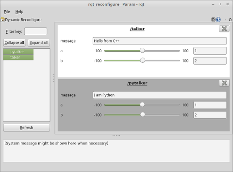
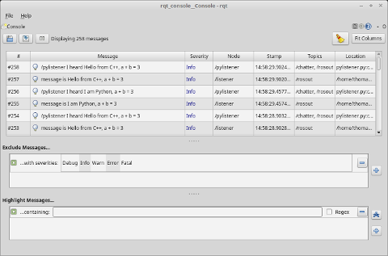

# Node Example

[ROS](http://ros.org) allows for creating nodes that communicate with each other.
It is very common to use C++ and Python to write these nodes.

This package contains example nodes written in C++ and Python that show minimal examples of using
some very basic but powerful features of ROS.
Those features include:

  * [parameter server](http://wiki.ros.org/Parameter%20Server)
  * [dynamic reconfigure](http://wiki.ros.org/dynamic_reconfigure/Tutorials)
  * [timers](http://wiki.ros.org/roscpp/Overview/Timers)
  * [custom messages](http://wiki.ros.org/ROS/Tutorials/DefiningCustomMessages)
  * classes with callback functions for
    [publishers and subscribers](http://wiki.ros.org/roscpp/Overview/Publishers%20and%20Subscribers)
  * [remap](http://wiki.ros.org/roslaunch/XML/remap) topic names

More ideas that are explored are deploying documentation using [GitHub Pages](https://pages.github.com/),
writing unit tests, and checking build status and code coverage.

## Description

There are several launch files included, the main one being `node_example.launch`.
This will start a talker and listener written in C++ and a talker and listener written in Python.
One GUI will open allowing you to see what messages are being recieved by the listeners and another GUI will allow
you to change the values sent from each talker.
Both listener nodes receive messages from both talkers, showing that the languages used to write the talkers and
listeners can be mixed.

## Usage

[Build a workspace](http://wiki.ros.org/catkin/Tutorials/create_a_workspace) containing this repository.
A `node_example.rosinstall` file has been included for convenience with [`wstool`](http://wiki.ros.org/wstool).

To start all the nodes run

    roslaunch node_example node_example.launch

You should see two windows open: `rqt_reconfigure` and `rqt_console`.
They will look like the following screenshots.

  

  

At this point you can modify the strings or numbers in the reconfigure GUI and you should see those changes show
up in the console GUI.
There are `enable` parameters in each of the talker nodes so that the nodes can effectively be paused during runtime.
This is a nice feature that allows easily turning system components on and off during operation for whatever reason
(such as wanting to run multiple similar nodes side-by-side for comparison without using too many CPU/RAM resources,
only running certain nodes when some conditions are met, etc.).

## Branches

The `master` branch will try to keep up with the latest long-term support release version of ROS (currently Kinetic).
The `hydro-dev` branch was tested on ROS Hydro, Indigo, and Kinetic.
The `fuerte-dev` branch was tested on ROS Fuerte.
